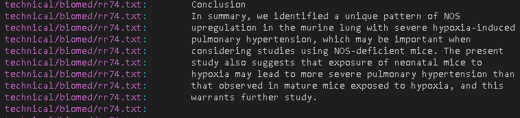
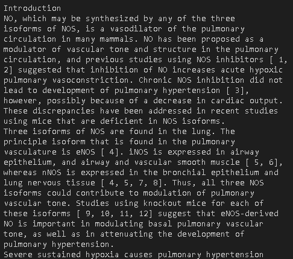
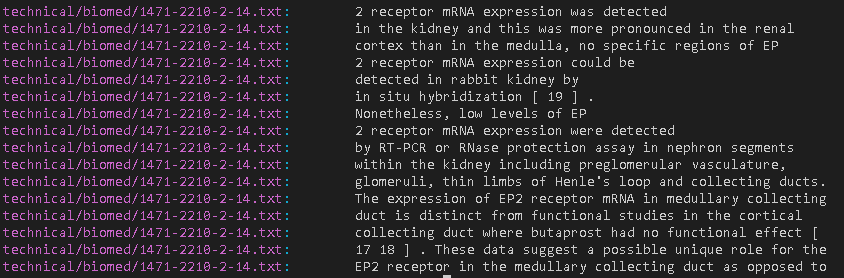
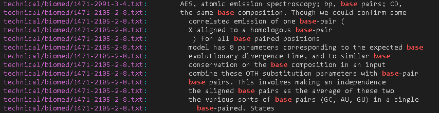
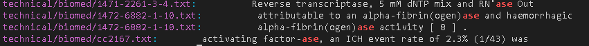
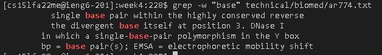
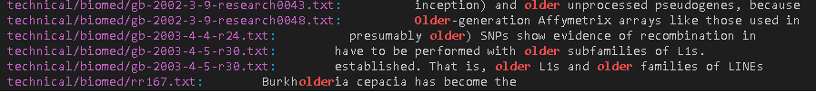
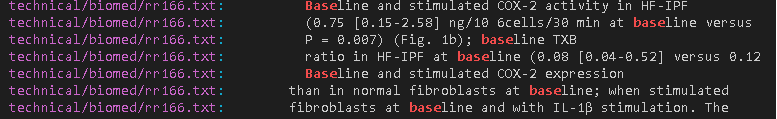
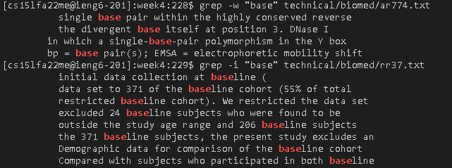

**Lab Report 3**

We will be exploring the grep command and 3 alternative ways to use grep with 3 example. We will use ```-v``` ```-w``` ```-i```.

```-v```

This command is useful when you want to find lines that does not contain a string.

```grep -v "base pair" technical/biomed/*.txt```

The output is:



This command will show all lines in all .txt files in technical/biomed that does not have the word "baes pair".

```grep -v "base pair" technical/biomed/rr74.txt```

The output is:



This command will show all lines in rr74.txt that does not have the word "base pair". This command is only for one .txt files

```grep -v "government" technical/biomed/*.txt```

The output is:



This command will show all lines in all .txt files in technical/biomed that does not have the word "government".

```-w```

This command is useful when you want to find exact words in a file.

```grep -w "base" technical/biomed/*.txt ```

The output is:



This command will show all lines in all .txt files in technical/biomed that contains the word "base". This command will only show lines that contain "base", words that contain "base" in its string like "based", "baseline" will not be included in the output.

```grep -w "ase" technical/biomed/*.txt ```

The output is:



This command will show all lines in all .txt files in technical/biomed that contains the word "ase". This command will only show lines that contain "ase", words like "base" or "based" will not be included in the output.

```grep -w "base" technical/biomed/ar774.txt```

The output is:



This command will show all lines in ar774.txt that contains the word "base". This is just an example only for one .txt files.

```-i```

This command is useful when you want to find words without being case sensitive

```grep -i "older" technical/biomed/*.txt```

The output is:



This command will show all lines in all .txt files in technical/biomed that contains the string "older" without being case sensitive.

```grep -i "Base" technical/biomed/*.txt```

The output is:



This command will show all lines in all .txt files in technical/biomed that contains the string "Base" without being case sensitive.

```grep -w "base" technical/biomed/ar774.txt```

The output is:



This command will show all lines in all .txt files in technical/biomed that contains the string "Base" without being case sensitive. This is just an example only for one .txt files.
