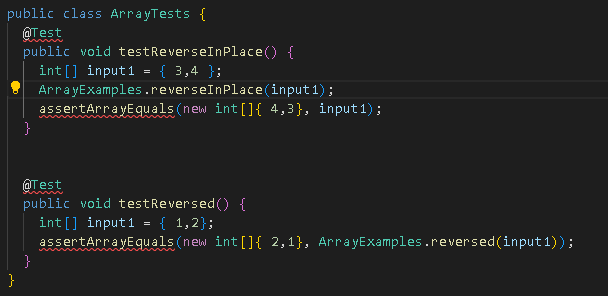
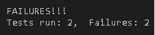
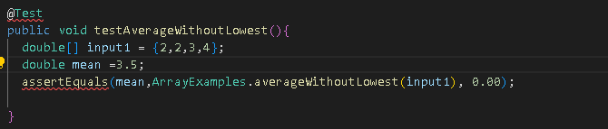

**Lab Report 1**


**Step 1: Looking up an account**
You need to look up your course specific account for CSE 15L:
Link to get there -> [Link](https://sdacs.ucsd.edu/~icc/index.php)


Change your password and wait for 15 minutes until you can use the password.

**Step 2: Installing VScode**

Install Visual studio code.

Link to get there -> [Link](https://code.visualstudio.com/)

Follow the instructions in the website on how to download vs code.

**Step 3: Remotely Connecting**

Open VScode and open the terminal. Type in ```ssh cs15lfa22me@ieng6.ucsd.edu``` where cs15lfa22me should be your account name. The two last letters should be different for each student so be careful when typing it.


Type yes, and enter your password. Once you are connected your terminal should look like this.


Remote connecting is the ability to access a computer or network through a network connection. Remote connecting is important because many courses in CSE use course-specific accounts and you might use this in the future!

**Step 4: Trying Some Commands**

You are now connected remotely! Let's try some commands such as cd, ls, and pwd.


**Step 5: Moving files with scp**

Here's the code for the WhereAmI.java:


Let's try to move files from your computer remotely! We will be using the scp command. We are trying to move a file called WhereAmI.java.
Compile WhereAmI.java in your computer and try to do it remotely!

Here's an example of it being compiled on my computer. 


Type in ```scp WhereAmI.java cs15lfa22me@ieng6.ucsd.edu:~/``` where cs15lfa22me should be your account name. If it runs correctly it should show this.


Log back in and try running the folder.


Notice that the output is different because its running in the remote computer.

**Step 6: Setting an SSH Key**

It becomes troublesome if you need to retype your password everytime you ```ssh``` or ```scp``` so here's a way to skip that part!

Type in ```ssh-keygen``` to create a public and private key. You will store the public key in the remote computer and the private key in your client.


Note: When given the prompt *Enter file in which to save the key (/Users/carls/.ssh/id_rsa.pub):* press enter again to specify the default path and take note of it. In this case, the default path is /Users/carls/.ssh/id_rsa.pub.

Log in to your remote computer and type ```mkdir .ssh``` to store the public key. 

Log out from the remote computer and type in 
```scp /Users/carls/.ssh/id_rsa.pub cs15lfa22me@ieng6.ucsd.edu:~/.ssh/authorized_keys```

Enter your password and everything is set up!

**Step 7: Optimizing Remote Running**

You can write a command in quotes at the end of an ssh command to directly run it on the remote server, then exit.

Example: ```ssh cs15lfa22@ieng6.ucsd.edu "pwd"``` will display the current directory on the remote computer.

Typing the up-arrow in your keyboard can recall your previous commands in the terminal.


**Lab Report 2**

**Part 1**

```
class Handler implements URLHandler {
    // The one bit of state on the server: a number that will be manipulated by
    // various requests.
    int num = 0;
    String s1="";
    public String handleRequest(URI url) {
     
        if (url.getPath().equals("/")) {
            return s1;
        } else if (url.getPath().contains("/add")) {
            String[] parameters = url.getQuery().split("=");
            s1 = s1+" "+parameters[1];
            return parameters[1];
        } else if (url.getPath().contains("/search")){
            return s1;
        }
    return "404 Not Found!";
    }
}
```


handleRequest Method will be called and the first else if statement will run. We will store the string after the "=" sign and store it in s1. If the string is changed, s1 will store a different string.


This runs the same method as above but we store a different string "apple" in s1.


handleRequest method is called, and the second else if statement will run. We will show the values in s1. The values in s1 was stored using the first else if statement.

**Part 2**

**ArrayExamples.java**



The failure inducing input is {3,4} and {1,2}. Below is the failing test output





The failure inducing input for this function is {2,2,3,4} because the method assumes that there are 1 lowest value so they divide by 3 elements for the mean, which would cause failure output.

Here are the changes to the bug which made all of them work:


The bug that causes the first function's symptom is because it subtracts 1 in each iterations which would skip some numbers. For the second function, the code is copying an empty array to the original array which makes it all 0. For the third bug, we need to count how many lowest values are there and subtract it to the array length at the return call.

**ListExamples.java**

Failure inducing input for the filter method {apple,APPLE,PINEAPPLE}, and the failure inducing input for the merge method is l1 = {apple} and l2 = {banana, cilantro, diamond}.


The symptom for filter method is as above, the list returned is {PINEAPPLE,APPLE) while expected is {APPLE,PINEAPPLE}. The symptom for merge method is that there is a OutOfMemoryError. 

Here are the changes to the bug which made all of them work:


The bug that causes the filter function is because it adds the checked list to index 0, which makes the list in reverse order. For the merge method, on the last while, index1 should be index2. The code made it that index2 will not be incremented so list2 will be added incorrectly.
