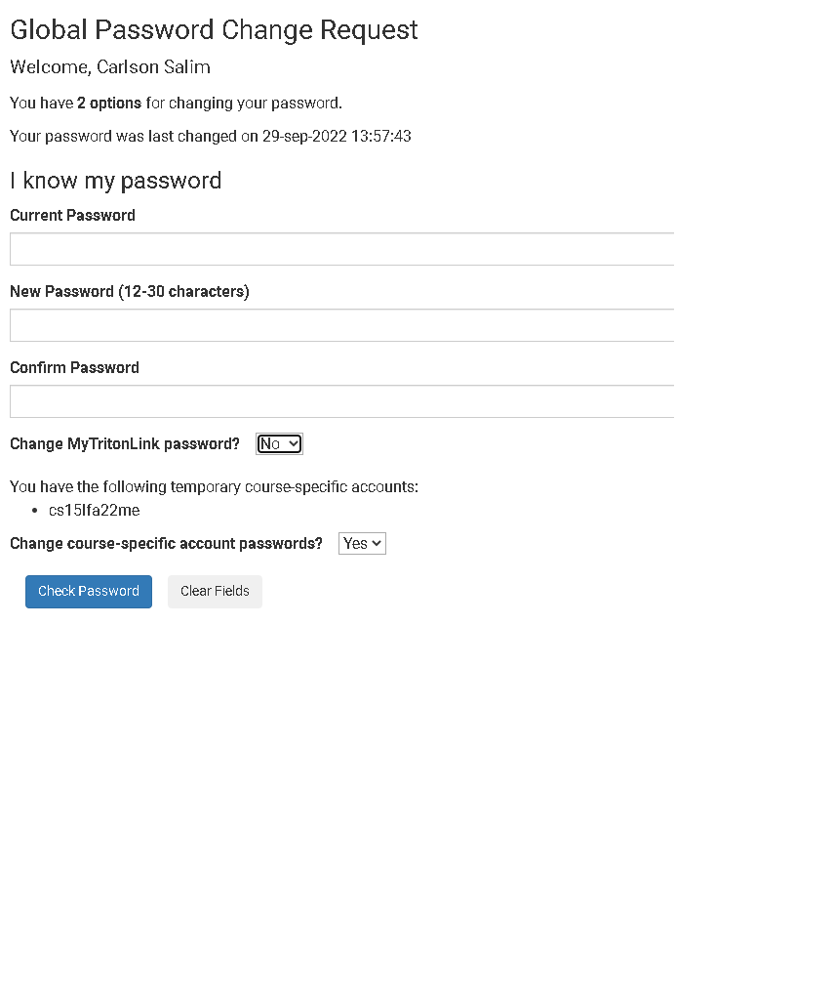
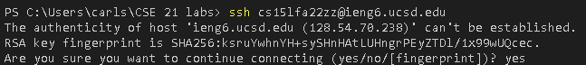
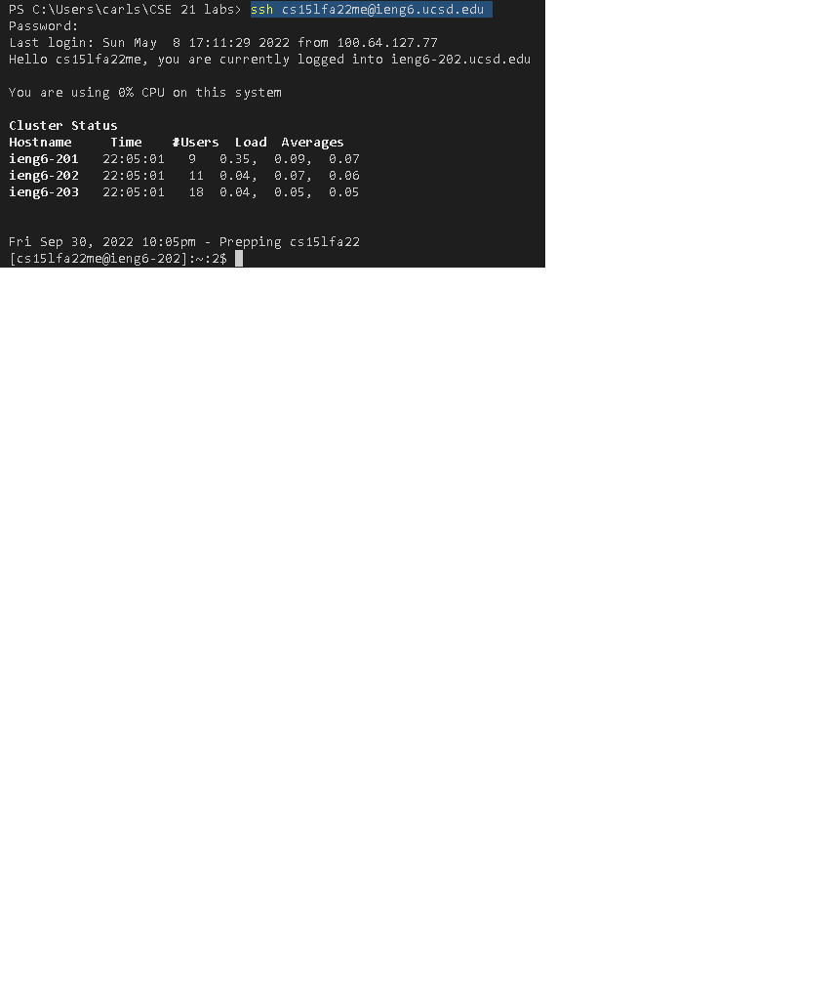
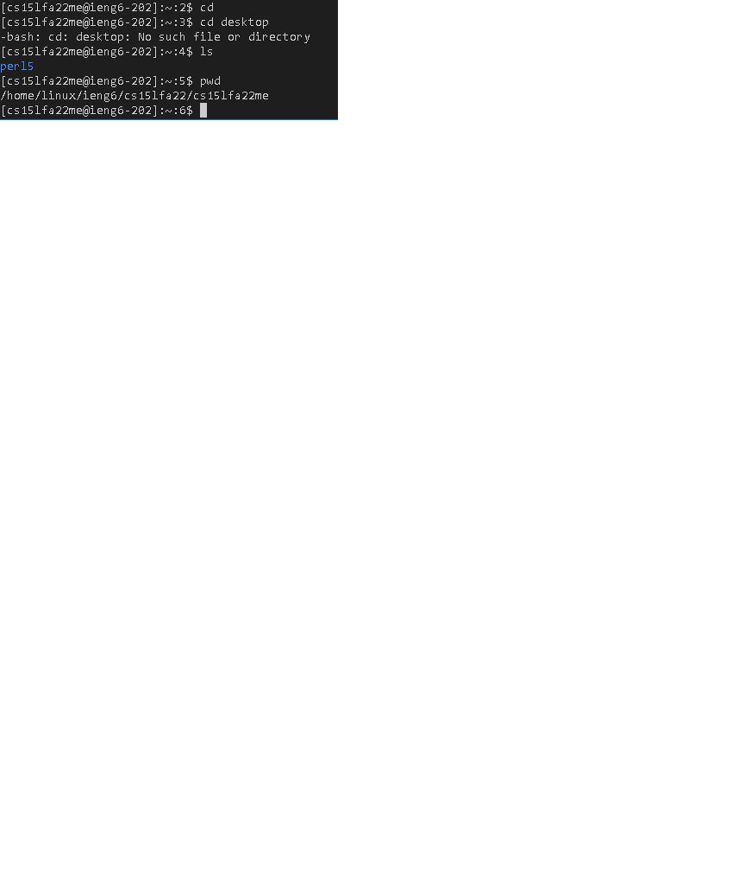
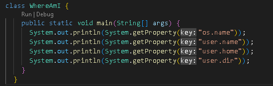
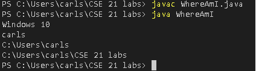
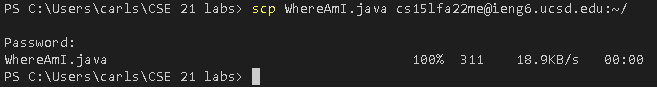
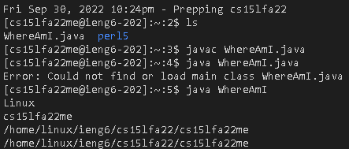
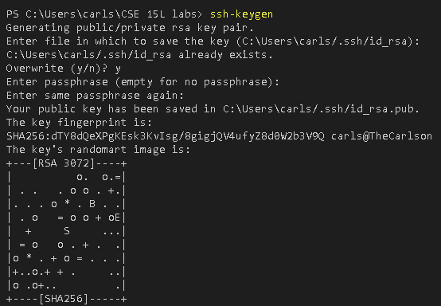

**Lab Report 1**


**Step 1: Looking up an account**
You need to look up your course specific account for CSE 15L:
Link to get there -> [Link](https://sdacs.ucsd.edu/~icc/index.php)


Change your password and wait for 15 minutes until you can use the password.

**Step 2: Installing VScode**

Install Visual studio code.

Link to get there -> [Link](https://code.visualstudio.com/)

Follow the instructions in the website on how to download vs code.

**Step 3: Remotely Connecting**

Open VScode and open the terminal. Type in ```ssh cs15lfa22me@ieng6.ucsd.edu``` where cs15lfa22me should be your account name. The two last letters should be different for each student so be careful when typing it.



Type yes, and enter your password. Once you are connected your terminal should look like this.



Remote connecting is the ability to access a computer or network through a network connection. Remote connecting is important because many courses in CSE use course-specific accounts and you might use this in the future!

**Step 4: Trying Some Commands**

You are now connected remotely! Let's try some commands such as cd, ls, and pwd.



**Step 5: Moving files with scp**

Here's the code for the WhereAmI.java:



Let's try to move files from your computer remotely! We will be using the scp command. We are trying to move a file called WhereAmI.java.
Compile WhereAmI.java in your computer and try to do it remotely!

Here's an example of it being compiled on my computer. 



Type in ```scp WhereAmI.java cs15lfa22me@ieng6.ucsd.edu:~/``` where cs15lfa22me should be your account name. If it runs correctly it should show this.



Log back in and try running the folder.



Notice that the output is different because its running in the remote computer.

**Step 6: Setting an SSH Key**

It becomes troublesome if you need to retype your password everytime you ```ssh``` or ```scp``` so here's a way to skip that part!

Type in ```ssh-keygen``` to create a public and private key. You will store the public key in the remote computer and the private key in your client.



Note: When given the prompt *Enter file in which to save the key (/Users/carls/.ssh/id_rsa.pub):* press enter again to specify the default path and take note of it. In this case, the default path is /Users/carls/.ssh/id_rsa.pub.

Log in to your remote computer and type ```mkdir .ssh``` to store the public key. 

Log out from the remote computer and type in 
```scp /Users/carls/.ssh/id_rsa.pub cs15lfa22me@ieng6.ucsd.edu:~/.ssh/authorized_keys```

Enter your password and everything is set up!

**Step 7: Optimizing Remote Running**

You can write a command in quotes at the end of an ssh command to directly run it on the remote server, then exit.

Example: ```ssh cs15lfa22@ieng6.ucsd.edu "pwd"``` will display the current directory on the remote computer.

Typing the up-arrow in your keyboard can recall your previous commands in the terminal.

