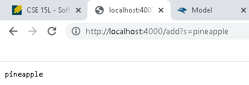
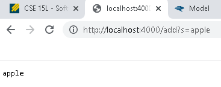
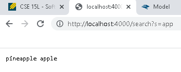
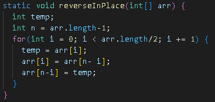
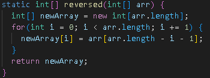
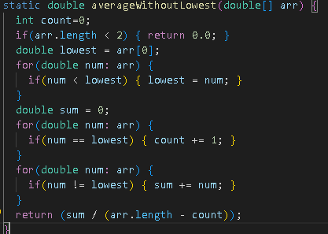
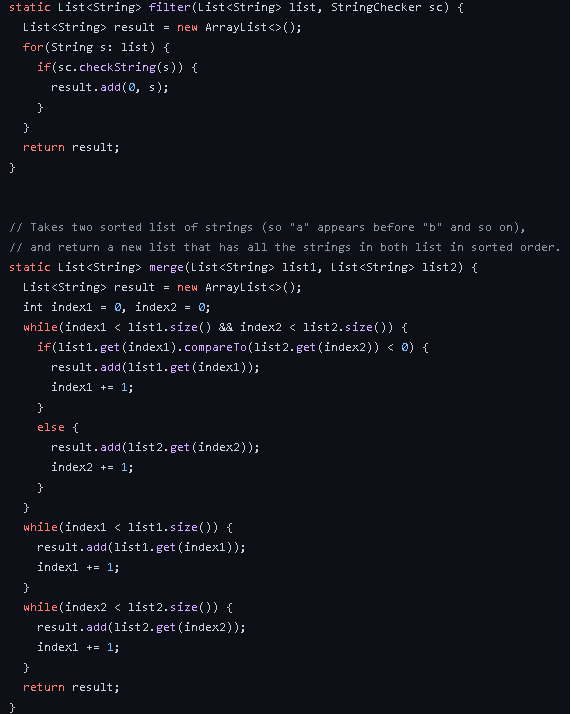
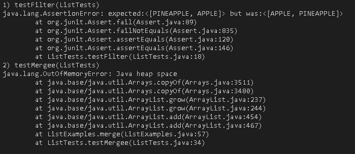
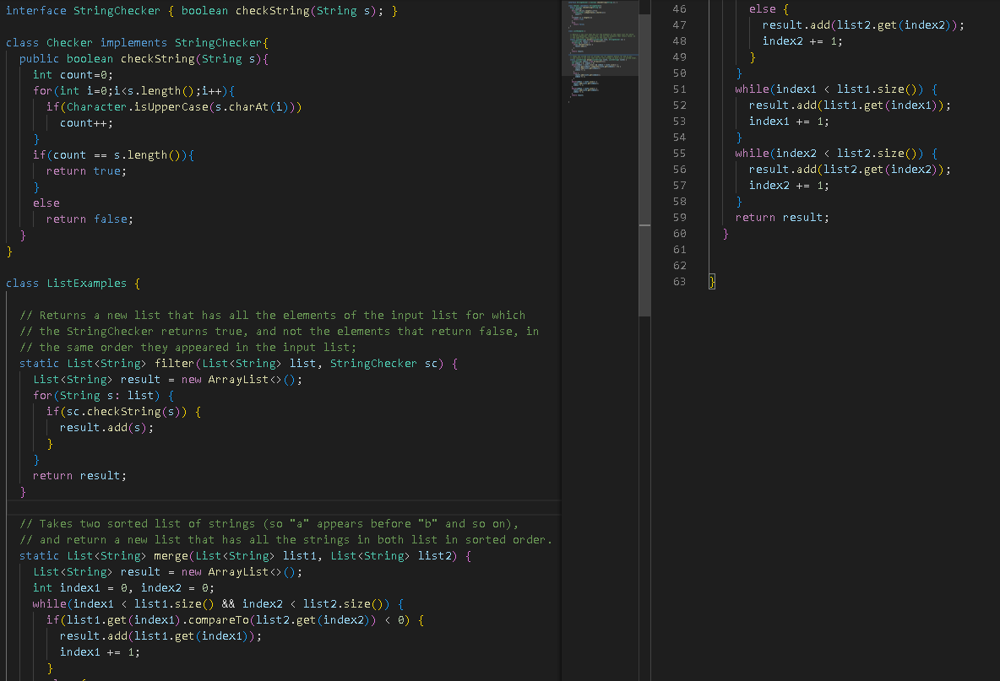
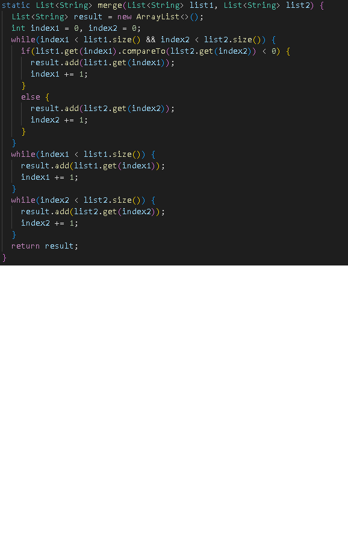

**Lab Report 1**


**Step 1: Looking up an account**
You need to look up your course specific account for CSE 15L:
Link to get there -> [Link](https://sdacs.ucsd.edu/~icc/index.php)


Change your password and wait for 15 minutes until you can use the password.

**Step 2: Installing VScode**

Install Visual studio code.

Link to get there -> [Link](https://code.visualstudio.com/)

Follow the instructions in the website on how to download vs code.

**Step 3: Remotely Connecting**

Open VScode and open the terminal. Type in ```ssh cs15lfa22me@ieng6.ucsd.edu``` where cs15lfa22me should be your account name. The two last letters should be different for each student so be careful when typing it.


Type yes, and enter your password. Once you are connected your terminal should look like this.


Remote connecting is the ability to access a computer or network through a network connection. Remote connecting is important because many courses in CSE use course-specific accounts and you might use this in the future!

**Step 4: Trying Some Commands**

You are now connected remotely! Let's try some commands such as cd, ls, and pwd.


**Step 5: Moving files with scp**

Here's the code for the WhereAmI.java:


Let's try to move files from your computer remotely! We will be using the scp command. We are trying to move a file called WhereAmI.java.
Compile WhereAmI.java in your computer and try to do it remotely!

Here's an example of it being compiled on my computer. 


Type in ```scp WhereAmI.java cs15lfa22me@ieng6.ucsd.edu:~/``` where cs15lfa22me should be your account name. If it runs correctly it should show this.


Log back in and try running the folder.


Notice that the output is different because its running in the remote computer.

**Step 6: Setting an SSH Key**

It becomes troublesome if you need to retype your password everytime you ```ssh``` or ```scp``` so here's a way to skip that part!

Type in ```ssh-keygen``` to create a public and private key. You will store the public key in the remote computer and the private key in your client.


Note: When given the prompt *Enter file in which to save the key (/Users/carls/.ssh/id_rsa.pub):* press enter again to specify the default path and take note of it. In this case, the default path is /Users/carls/.ssh/id_rsa.pub.

Log in to your remote computer and type ```mkdir .ssh``` to store the public key. 

Log out from the remote computer and type in 
```scp /Users/carls/.ssh/id_rsa.pub cs15lfa22me@ieng6.ucsd.edu:~/.ssh/authorized_keys```

Enter your password and everything is set up!

**Step 7: Optimizing Remote Running**

You can write a command in quotes at the end of an ssh command to directly run it on the remote server, then exit.

Example: ```ssh cs15lfa22@ieng6.ucsd.edu "pwd"``` will display the current directory on the remote computer.

Typing the up-arrow in your keyboard can recall your previous commands in the terminal.


**Lab Report 2**

**Part 1**

```
class Handler implements URLHandler {
    // The one bit of state on the server: a number that will be manipulated by
    // various requests.
    int num = 0;
    String s1="";
    public String handleRequest(URI url) {
     
        if (url.getPath().equals("/")) {
            return s1;
        } else if (url.getPath().contains("/add")) {
            String[] parameters = url.getQuery().split("=");
            s1 = s1+" "+parameters[1];
            return parameters[1];
        } else if (url.getPath().contains("/search")){
            return s1;
        }
    return "404 Not Found!";
    }
}
```



handleRequest Method will be called and the first else if statement will run. We will store the string after the "=" sign and store it in s1. If the string is changed, s1 will store a different string.



This runs the same method as above but we store a different string "apple" in s1.


handleRequest method is called, and the second else if statement will run. We will show the values in s1. The values in s1 was stored using the first else if statement.

**Part 2**

**ArrayExamples.java**

Here are the code with bugs:



The failure inducing input is {3,4}. The failing test output was {3,3} which should have been {4,3}. The bug was ```arr[i] = arr[arr.length - i - 1];```. I changed the code to the screenshot above. The bug caused that output because the code would only copy the second half of the array to the first half. So the second half of the array stays the same which is 3 for this input.


The failure inducing input is {1,2}. The failing test output was {0,0} which should have been {2,1}. The bug was ```arr[i] = newArray[arr.length - i - 1];```
and ```return arr```. I changed the code to the screenshot above. The bug caused the output because the code would copy an empty array to the original array which would return 0 for all elements of the array. For this input, the returned array would have 0 for all of its elements.


The failure inducing input for this function is {2,2,3,4}. because the method assumes that there is only 1 lowest value so they divide by 3 elements for the mean, which would return 2.33 instead of 3.50. The bug was ``` return sum / (arr.length - 1)```. I changed the code to the screenshot above. I added another for loop to count the number of the lowest element in the array and changed the return statement. The bug caused the ouput because it will assume that there is only 1 lowest value. For this input, the method returns sum divided by 3 instead of 2, which would return 2.33 instead of 3.50.


**ListExamples.java**

Here are the code with bugs:






Failure inducing input for the filter method {apple,APPLE,PINEAPPLE}. The symptom for filter method is as above, the list returned is {PINEAPPLE,APPLE) while expected is {APPLE,PINEAPPLE}. The bug was ```result.add(0, s);```. It always adds the checked string to index 0 of the list. I changed the code to the screenshot above. For this input, the method adds APPLE to index 0 and when it adds PINEAPPLE to index 0 it moves APPLE to index 1. The expected output should have been APPLE in index 0 and PINEAPPLE in index 1.

Failure inducing input for the merge method is l1 = {apple} and l2 = {banana, cilantro, diamond}. The symptom for merge method is that there is a OutOfMemoryError. The bug for this method is:
```
    while(index2 < list2.size()) {
      result.add(list2.get(index2));
      index1 += 1;
    }
```
The code should have been index2+=1. For this input, on the first while loop apple is added to result list. On the while loop above, Since index2 is never incremented the while loop will run infinitely since index2 will never be less than list2.size(). So cilantro is added to the result list infinitely until we run out of memory. 

Here is the change:




**Lab Report 3**

We will be exploring the grep command and 3 alternative ways to use grep with 3 example. We will use ```-v``` ```-w``` ```-i```.

```-v```

This command is useful when you want to find lines that does not contain a string.

```grep -v "base pair" technical/biomed/*.txt```

The output is:


This command will show all lines in all .txt files in technical/biomed that does not have the word "baes pair".

```grep -v "base pair" technical/biomed/rr74.txt```

The output is:


This command will show all lines in rr74.txt that does not have the word "base pair". This command is only for one .txt files

```grep -v "government" technical/biomed/*.txt```

The output is:


This command will show all lines in all .txt files in technical/biomed that does not have the word "government".

```-w```

This command is useful when you want to find exact words in a file.

```grep -w "base" technical/biomed/*.txt ```

The output is:


This command will show all lines in all .txt files in technical/biomed that contains the word "base". This command will only show lines that contain "base", words that contain "base" in its string like "based", "baseline" will not be included in the output.

```grep -w "ase" technical/biomed/*.txt ```

The output is:


This command will show all lines in all .txt files in technical/biomed that contains the word "ase". This command will only show lines that contain "ase", words like "base" or "based" will not be included in the output.

```grep -w "base" technical/biomed/ar774.txt```

The output is:


This command will show all lines in ar774.txt that contains the word "base". This is just an example only for one .txt files.

```-i```

This command is useful when you want to find words without being case sensitive

```grep -i "older" technical/biomed/*.txt```

The output is:


This command will show all lines in all .txt files in technical/biomed that contains the string "older" without being case sensitive.

```grep -i "Base" technical/biomed/*.txt```

The output is:


This command will show all lines in all .txt files in technical/biomed that contains the string "Base" without being case sensitive.

```grep -w "base" technical/biomed/ar774.txt```

The output is:


This command will show all lines in all .txt files in technical/biomed that contains the string "Base" without being case sensitive. This is just an example only for one .txt files.

